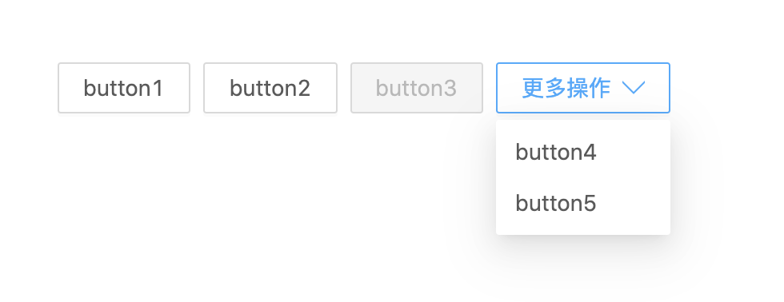

# boss-button-group 按钮组

### 使用方法

> yarn add @vins-rc/button-group

```js
import ButtonGroup from '@vins-rc/button-group'
function TestDemo() {
  const items = [
    {
      text: 'button1',
      key: 'add1',
    },
    {
      text: 'button2',
      key: 'add2',
    },
    {
      text: 'button3',
      key: 'add3',
      disabled: true,
    },
    {
      text: 'button4',
      key: 'add4',
    },
    {
      text: 'button5',
      key: 'add5',
    },
  ]
  const onClick = (k) => {
    console.log(k)
  }
  return <ButtonGroup items={items} type="link" onClick={onClick} />
}
```

### 效果图


## 文档
### ButtonGroup 组件参数
| 参数     | 说明         | 类型     | 是否可选(可选值) | 默认值 |
| -------- | ----------- | ------- | -------------- | ------ |
| items    | 按钮项配置    | ButtonItemProps  | 必填  | -  |
| max      | 最大的按钮数  | RowProps  | -  | 3 |
| type     | 显示的按钮类型 | link ｜ button  | -  | link  |
| onClick  | 点击的回调    | (key: string) => void | -  | -  |

### ButtonItemProps 参数
**Button** 组件本身支持的参数不再展示

| 参数     | 说明         | 类型     | 是否可选(可选值) | 默认值 |
| -------- | ----------- | ------- | -------------- | ------ |
| text     | 按钮文字     | string  | 必填  | -  |
| key      | 按钮的点击回调标示  | string  | 必填  | - |
| hidden   | 是否隐藏     | boolean  | -  | -  |
| disabled | 是否可操作   | boolean | -  | -  |
| confirm  | 是否二次确认  | boolean | -  | -  |
| confirmTitle | 二次确认的标题   | React.ReactNode | -  | -  |
| confirmProps | 二次确认的配置   | [PopconfirmProps](https://ant.design/components/popconfirm-cn/#API) | -  | -  |
| ...  | 按钮本身支持的参数    | [ButtonProps](https://ant.design/components/button-cn/#API) | -  | -  |
